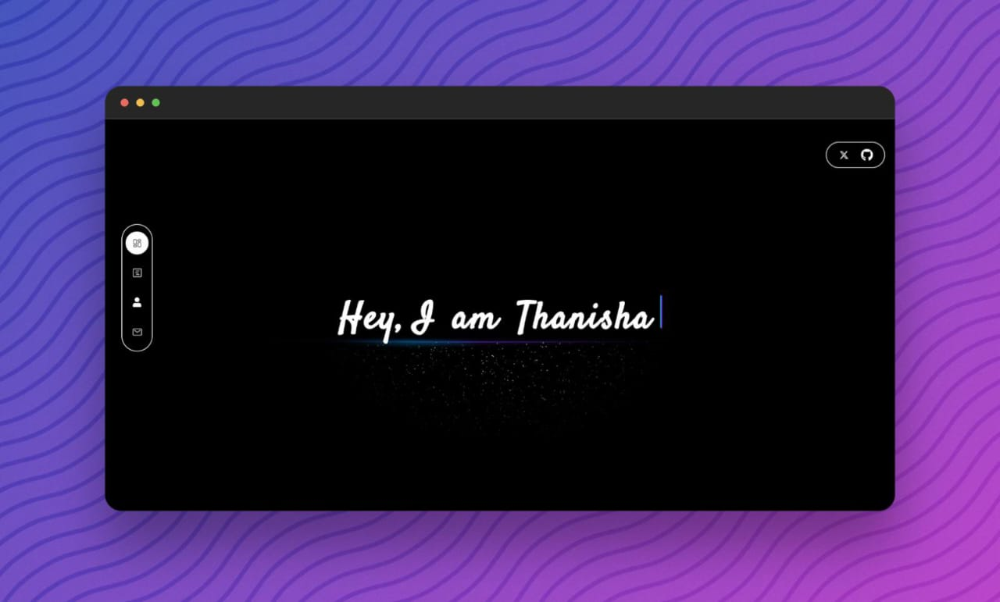

<h1 align="center">Portfolio Website</h1>

  

<h4>Hello folks,Here is my portfolio</h3>

## Technology used: 

<h4>If you like the project don't forget to give it a star ⭐</h4>

<h4>Made by Thanisha Belchada</h4>

